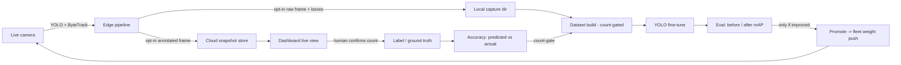

# The CamAI accuracy flywheel

Accuracy is the moat. A CCTV-analytics product lives or dies on *"what's your
false-alarm rate?"*, and the only durable way to answer that — and keep improving
it — is a loop that turns every deployed camera's real footage into better models.

This document describes that loop as it is wired in the repo: how a live camera
becomes a measured accuracy number and, eventually, an improved model, without
breaking the edge-first privacy contract (only counts/events leave a site unless
the operator opts in to sharing frames).



The loop: **capture → label → ground truth → measured accuracy → retrain → promote → redeploy**.

---

## 1. Capture (edge)

Two opt-in, off-by-default per-camera settings in the site config
(`CameraConfig`, `packages/edge-agent/camai_edge/config.py`):

| field | meaning |
| --- | --- |
| `snapshot_seconds` | Seconds between **annotated** snapshots uploaded to the cloud for live view + labelling. `0` disables. |
| `capture_dir` | Local directory to also write **raw** frames + detection sidecars for building a fine-tune dataset. `""` disables. Requires `snapshot_seconds > 0`. |

Both are **privacy-first**: nothing leaves the site, and no imagery is written,
until the operator turns them on. The cloud only ever receives a single annotated
frame the camera *chose* to share, never a continuous stream.

- **Annotated upload** — `camai_edge/snapshots.py` (`SnapshotUploader`): draws
  detection boxes + zone overlays onto a copy of the frame, JPEG-encodes it, and
  POSTs it with the model's `predicted_count`. Best-effort; never blocks the
  pipeline.
- **Raw capture** — `camai_edge/capture.py` (`FrameCapture`): writes the raw
  (un-annotated) frame plus a JSON sidecar of the model's detections. This is the
  training data source. On-disk layout:

  ```
  <capture_dir>/<camera_id>/<ts_ms>.jpg     # raw frame
  <capture_dir>/<camera_id>/<ts_ms>.json    # sidecar
  ```

  Sidecar schema:

  ```json
  {
    "camera_id": "cam-front-door",
    "mode": "retail",
    "ts": "2026-10-03T12:00:00+00:00",
    "frame_size": [768, 432],
    "predicted_count": 2,
    "boxes": [{"cls_name": "person", "conf": 0.91, "xyxy": [10, 20, 30, 120]}]
  }
  ```

Both are wired at the snapshot cadence in `camai_edge/pipeline.py`.

Example config (`packages/edge-agent/demo-localhost.yaml`):

```yaml
cameras:
  - id: cam-front-door
    source: sample.mp4
    mode: retail
    snapshot_seconds: 3      # upload an annotated frame every 3s
    capture_dir: "capture"   # also save raw frames + boxes here
    lines: [...]
```

## 2. Label (cloud + dashboard)

The cloud snapshot store (`packages/cloud/app/snapshots.py`, endpoints in
`app/main.py`) is standalone — a SQLite metadata table + image files on disk,
independent of the main event store:

| endpoint | purpose |
| --- | --- |
| `POST /v1/ingest/snapshot` | edge uploads `{tenant_id, camera_id, mode, ts, predicted_count, image_b64}` |
| `GET /v1/tenants/{t}/cameras/{c}/snapshot.jpg` | latest annotated frame (image/jpeg) |
| `GET /v1/tenants/{t}/cameras/{c}/snapshot` | latest metadata (`predicted_count`, `labeled_count`, …) |
| `POST /v1/tenants/{t}/cameras/{c}/label` | `{actual_count}` — the **human ground truth** |
| `GET /v1/tenants/{t}/accuracy` | predicted-vs-labelled error, overall and per mode |

Storage locations are env-configurable: `CAMAI_SNAPSHOT_DB` (default `:memory:`)
and `CAMAI_SNAPSHOT_DIR` (default a temp dir).

On the dashboard (`packages/dashboard/app/cameras/[id]`): a **Live view** card
shows the latest annotated frame (polled), a **Confirm count** form lets a
reviewer enter the real count, and a **Model accuracy** card (Overview) shows the
error trend. The reviewer's confirmed count is the label.

## 3. Measure accuracy

`GET /v1/tenants/{t}/accuracy` compares each labelled snapshot's `predicted_count`
against the human `actual_count`:

```json
{
  "overall": {"n": 2, "mae": 1.5, "mean_pct_error": 58.3},
  "per_mode": [{"mode": "capacity", "n": 1, "mae": 2.0, "mean_pct_error": 66.7}]
}
```

`mae` = mean absolute count error; `mean_pct_error` = mean percent error. This is
the number that must go **down** as the loop turns — the sales proof and the
regression guard.

## 4. Retrain (`packages/training`, `camai_training`)

Our labels are **counts, not bounding boxes**, so the retrain uses **count-gated
pseudo-labelling** (self-training): the model's own detections on captured frames
become training labels, **trusted where the human-confirmed count matches the
model's count**, and routed to manual box-labelling where it doesn't. The count
label is the correctness gate.

Modules:

- `dataset.py` (pure stdlib) — `build_dataset(capture_root, out_dir, …)` turns
  captured frames + sidecars into a YOLO dataset (`images/`, `labels/`,
  `data.yaml`) over the canonical classes
  `["person","vehicle","forklift","pallet","fire","smoke"]`. `trusted_cameras_from_accuracy(...)`
  derives the count-gate from `/accuracy`.
- `retrain.py` — `fine_tune(...)` wraps `ultralytics` `YOLO.train` (lazy import;
  the `[train]` extra). Returns the produced `best.pt`.
- `evaluate.py` — `evaluate(...)` / `compare(...)` for before/after mAP.
- `promote.py` — stages the new weights; deployment is via the cloud **fleet
  release-pinning** (`packages/cloud/app/fleet.py`), so a validated model rolls
  out to devices (with canary) rather than being hot-swapped blindly.
- `run.py` — the `camai-retrain` CLI orchestrating: fetch accuracy (count-gate) →
  build dataset → fine-tune → eval → **promote only if mAP improved**.

### Run it

```bash
# plan only: build the dataset and print the train command (no training)
PYTHONPATH="packages/schema;packages/edge-agent;packages/training" \
  python -m camai_training.run \
  --capture-root packages/edge-agent/capture \
  --tenant demo-tenant --cloud-url http://localhost:8000 --no-train

# full loop: build -> fine-tune -> eval -> promote-if-improved
PYTHONPATH="packages/schema;packages/edge-agent;packages/training" \
  python -m camai_training.run \
  --capture-root packages/edge-agent/capture \
  --base-weights packages/edge-agent/yolo11n.pt \
  --out ./retrain_out --epochs 50 --device 0 \
  --promote-dir ./retrain_out/promoted
```

The promote step is **gated on improvement**: a fine-tune that doesn't beat the
current model on mAP is *not* shipped. (In a tiny CPU smoke-run — a few images,
one epoch — the fine-tune will usually make mAP worse and the pipeline correctly
declines to promote. That is the guardrail working, not a failure. Real accuracy
gains need data volume + epochs + a GPU.)

## End-to-end demo

With the cloud API on `:8000` and an edge agent running
`demo-localhost.yaml --loop` (snapshots + capture enabled):

1. Open the dashboard → **Cameras** → a camera → watch the **Live view**.
2. Enter the real count in **Confirm count** → the **Model accuracy** card updates.
3. Let the edge agent accumulate captured frames, then run `camai-retrain`.

## Honest limitations / what's next

- **Counts, not boxes.** Count labels gate and measure; they don't directly
  supervise a detector. The pipeline pseudo-labels from the model and gates on the
  count. The next step is an **active-learning box-labelling UI** for the frames
  the count-gate rejects.
- **Scale.** Meaningful accuracy gains need real data volume, more epochs, and a
  GPU. The repo proves the *mechanism*, runnable at tiny scale on CPU.
- **Missing models.** `fire`, `thermal`, `proximity`, and PPE classes aren't in
  COCO, so those verticals need trained detectors before the loop improves them
  on real footage.
- **Object storage.** Snapshots/clips are on local disk today; production wants an
  object store (the schema's `clip_ref` is reserved for this).
